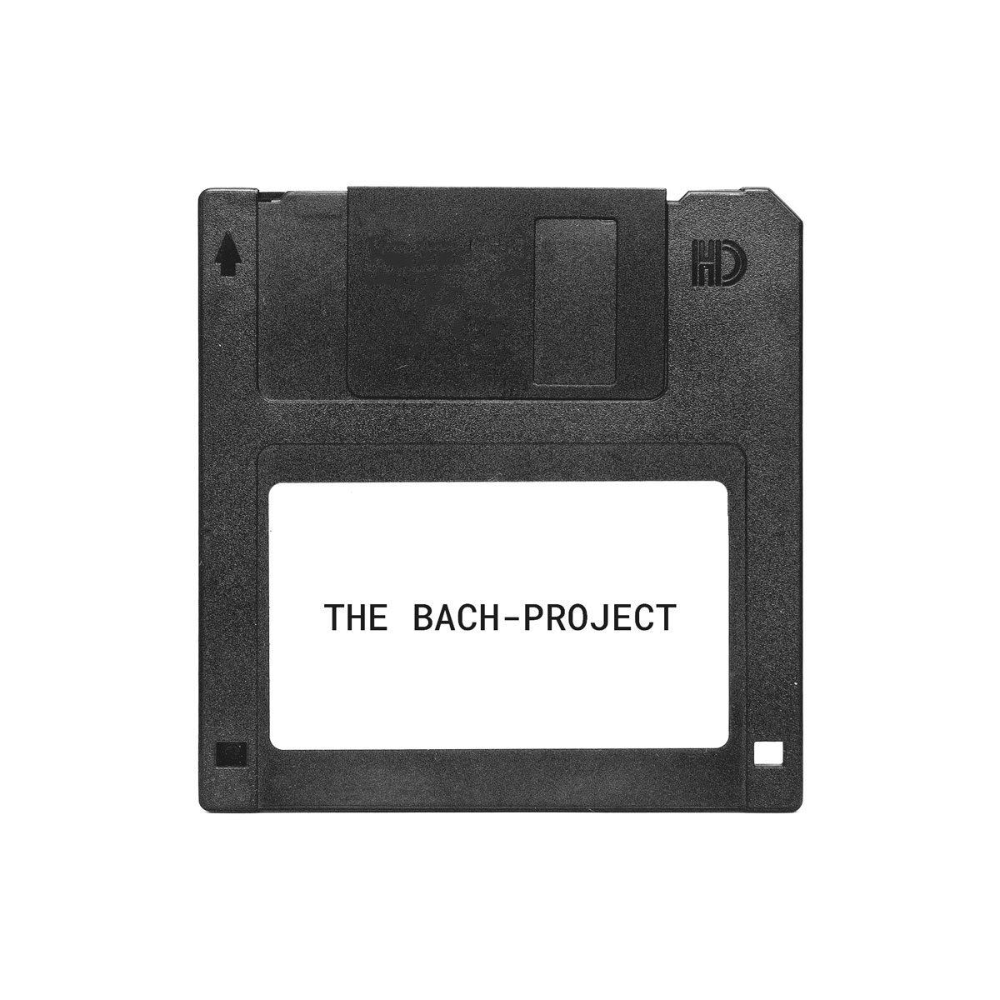

# THE BACH PROJECT
The prelude of BWV846, ready to use in Processing.

In summer 2017 i've started a self-initiated art-project to explore the creative potencial of musical data: THE BACH-PROJECT. The idea is very simple: I use the sheet-music of the "Prelude in C" (BWV846) by Johann Sebastian to create generative music visualizations.

So why that piece? Because it has a few characteristics that qualify it to be the perfect material for generative visualizations:

- It is monophonic, so there are no notes overlapping
- It is played only on one instrument (keyboard)
- It follows a minimal, consistent rhythmical pattern, that does not allow any variation: 1 2 3 4 5 1 2 3  
- Basically it is a plain sequence of 34 bars with 16 16th-notes each
- each bar represents a chord
- It has an array-like structure by nature
- The chord-progression is interesting but quite simple

---

This repository contains the optimized data that can simply be used to create interesting visualizations. Do you have any ideas how the data can be optimized? Please let me know by opening an issue or by writing a mail to post@timrodenbroeker.de

Thank you!

---

I am very curious in what you make with the data. Please let me know how you use it!
